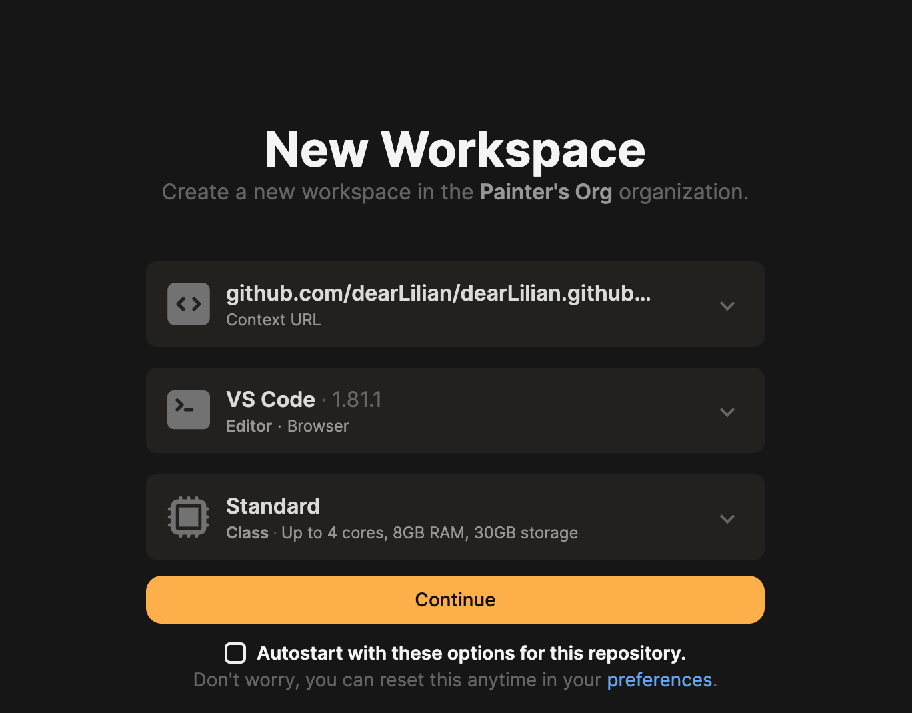
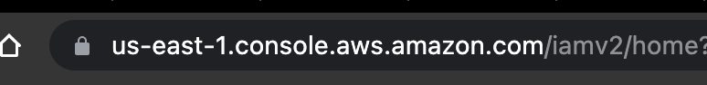

# AWS新手上手

## 注册账号

IAM user

IAM Group


## 安装`aws cloudshell`

首先移除之前的版本，如果存在的话。

```
sudo yum remove awscli
```


一键安装代码：


linux x86:

```
curl "https://awscli.amazonaws.com/awscli-exe-linux-x86_64.zip" -o "awscliv2.zip"
unzip awscliv2.zip
sudo ./aws/install
```

##  Online IDE For GitHub: 使用gitpod云开发

Gitpod是一个在线IDE，可以从任何GitHub页面启动。只需在任何GitHub-URL前加上`https://gitpod.io#`

例如：我的一个仓库链接是：`https://github.com/dearLilian/dearLilian.github.io`

那么在这个仓库上使用gitpod的链接就是：
`https://gitpod.io/new/#github.com/dearLilian/dearLilian.github.io`

此时，会出现账户关联的选项，可以根据提示绑定github账号（关联linkedin还能增加使用时间），若不是第一次使用，则会出现新建workspace的内容。




### 配置gitpod的aws cloud shell

加载出来gitpod的vscode应用后，按照项目的gitpod配置会自动安装aws cli。

接下来需要配置aws以使gitpod中可以访问我们的aws账号。

命令行方式：

```
aws configure
```

执行上述命令后，会依次让配置四个内容：

- AWS Access Key ID
- AWS Secret Access Key
- Default region name
- Default output format

前面两个是在aws用户页中，创建访问秘钥，选择 aws cli关联，下一步后生成一个可以看得见的id是access id，另外一个默认看不见的是secret access key，要注意立即复制，保存一下。

default regin name则直接复制你访问aws的链接的前缀即可。

