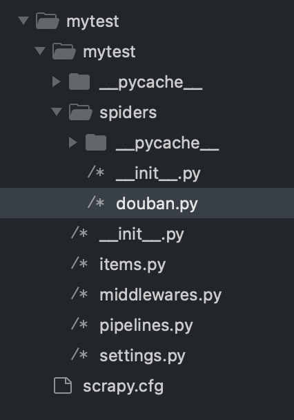

---

title:"scrapy爬虫入门"

subtitle:"使用框架进行爬虫"

author:"Painter"

header-img:"img/post-bg-2015.jpg"

date:2023-09-05 08:13:00

tag:

    - PainterPython

    - 爬虫

---


## 安装scrapy


```shell
pip install scrapy

```


## 创建爬虫项目


```shell
scrapy startproject project_name
```


## 开始爬虫


**You can start your first spider with:**

```shell
cd mytest
scrapy genspider douban douban.com
```




然后开始编辑douban.py这个文件代码。
