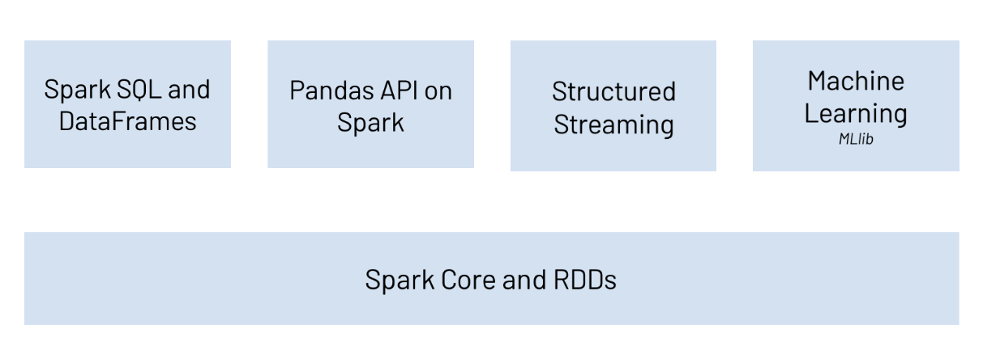
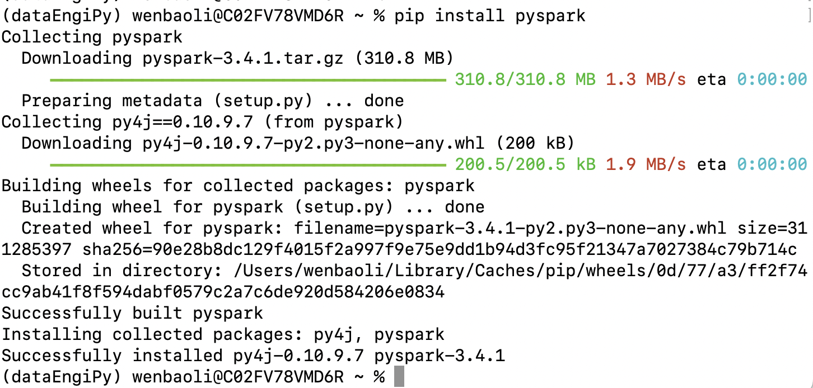

---
title:"pyspark入门学习笔记"

subtitle:"data engineering必知必会之：PySpark"

author:"Painter"

header-img:"img/post-bg-2015.jpg"

date:2023-09-12 16:13:00

tag:
    - PainterPython
    - Python
    - Spark
---
# PySpark简介

PySpark是一个Python库，用于与Apache Spark分布式计算框架集成，用于处理大规模数据集。它允许您使用Python编程语言进行分布式数据处理和分析。pyspark是Apache Spark的python API。通过该库，我们可以使用python在分布式环境下来处理实时、大规模的数据。

pyspark充分利用python的易用性以及Apache Spark在分布式处理上的优势，使得分布式处理分析大规模数据变得简单易上手。

PySpark支持所有Apache Spark的特性：

- Spark SQL
- DataFrames
- Structured Streaming
- Machine Learning
- Spark Core



## Spark SQL与DataFrames

Spark SQL是Spark处理结构化数据的模块。该模块可以使得我们通过spark程序无缝地执行SQL查询语句。使用python和SQL，基于DataFrame结构，我们可以对数据进行高效地读写、变换、分析等。无论使用 Python 还是 SQL，都使用相同的底层执行引擎，因此我们能始终充分利用 Spark 的全部功能。

## Pandas API on Spark


## Structured Streaming


## Machine Learning

## Spark Core and RDDs


# 环境安装

可以使用`pip`来安装PySpark：`pip install pyspark`。但首先，需要安装Java和Spark，并设置正确的环境变量。

```shell
pip install pyspark
```

更多详细地安装方法则可以参考官方指导：

[官方安装指导](https://spark.apache.org/docs/latest/api/python/getting_started/install.html)

pip安装结果示例如下：




## 快速入门DataFrame


## 创建DataFrame


### 什么是DataFrame


Apache Spark DataFrame 是一种分布式数据集，它具有类似于关系数据库或Pandas DataFrame的表格结构。DataFrame是Spark SQL模块的一部分，用于处理结构化数据，支持SQL查询和复杂的数据操作。以下是关于Spark DataFrame的一些关键信息：

1. **结构化数据：** DataFrame是结构化数据的集合，每一列都有一个名称和一个数据类型。这使得它适用于处理半结构化和结构化数据，如CSV、JSON、Parquet等格式。
2. **分布式性能：** Spark DataFrame被设计为分布式数据结构，可以跨多台计算机并行处理大规模数据集。这使得它非常适合处理大数据。
3. **操作和转换：** 您可以使用DataFrame API执行各种数据操作和转换，例如过滤、选择、分组、聚合、连接、排序等。这些操作类似于SQL查询，使您能够以声明性方式定义数据处理任务。
4. **SQL查询：** Spark DataFrame支持SQL查询，这意味着您可以使用SQL语法执行查询以从DataFrame中提取数据。
5. **缓存和优化：** Spark会自动执行查询计划的优化，以提高性能。您还可以选择将DataFrame的部分或全部数据缓存在内存中，以加速重复查询。
6. **数据源和格式：** Spark DataFrame支持各种数据源和格式，包括文本、Parquet、JSON、Avro、ORC等。您可以使用`read`方法来加载这些数据源，然后将其转换为DataFrame进行分析。
7. **与Python、Scala、Java和R集成：** Spark DataFrame可以与多种编程语言集成，包括Python、Scala、Java和R。这使得它成为多语言数据分析和处理的理想工具。
8. **机器学习：** Spark的MLlib库与DataFrame集成，可以轻松进行机器学习任务，如分类、回归、聚类等。

下面是一个简单的示例，展示如何使用PySpark创建和操作一个DataFrame：

```python
from pyspark.sql import SparkSession

# 创建Spark会话
spark = SparkSession.builder.appName("example").getOrCreate()

# 从CSV文件加载数据创建DataFrame
df = spark.read.csv("data.csv", header=True, inferSchema=True)

# 显示DataFrame的前几行数据
df.show()

# 执行一个筛选操作
filtered_df = df.filter(df["age"] > 30)

# 执行一个聚合操作
avg_age = df.groupBy("gender").avg("age")

# 执行一个SQL查询
result = spark.sql("SELECT gender, COUNT(*) FROM df GROUP BY gender")

# 停止Spark会话
spark.stop()
```

这只是Spark DataFrame的一个简单示例。您可以根据具体的需求使用更多的DataFrame操作和功能来处理和分析数据。
